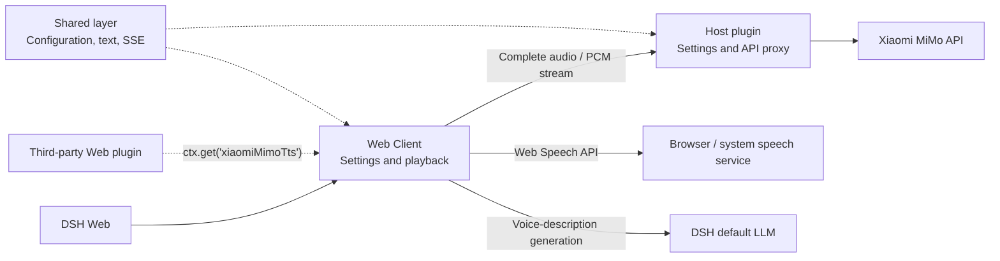

# dsh-xiaomi-tts

[](https://www.npmjs.com/package/dsh-xiaomi-tts)
[](https://github.com/ppy-web/dsh-plugin-xiaomi-mimo-tts)
[](https://www.npmjs.com/package/dsh-xiaomi-tts)
[](https://github.com/deepseek-ai)


Add Xiaomi MiMo TTS read-aloud, browser-local fallback speech, and optional UI sounds to DSH Web.

> MiMo TTS availability and pricing may change. Check the official Xiaomi MiMo platform for the current policy.

<p><a href="README.md"><strong>中文说明 →</strong></a></p>

## 🎨 Preview

- [Open the interactive Preview Pages](https://ppy-web.github.io/dsh-plugin-xiaomi-mimo-tts)

| Settings | Message action |
|:---:|:---:|
|  |  |

## ✨ Features

- One-click read-aloud action on assistant messages.
- Low-latency PCM streaming for `mimo-v2.5-tts`, with complete-audio or browser-speech fallback when appropriate.
- Official built-in voices and text-described custom voices through `mimo-v2.5-tts-voicedesign`.
- MiMo-first, local-first, or MiMo-only speech strategies.
- Smart, full, and first-segment read-aloud ranges.
- 0.5×–2.0× playback speed, voice volume, pause, resume, and stop controls.
- Text preparation that removes URLs, paths, code blocks, emoji, and control characters before synthesis.
- Broadcast Studio previews that identify MiMo versus browser-local playback and explain common failures.
- Optional task and semantic click sounds, disabled by default.
- An optional PCM playback service for other DSH Web plugins.

## 📋 Requirements

- `@deepseek-ai/dsh` `0.1.6-alpha.2` (the currently verified version)
- Node.js 22+
- A Xiaomi MiMo API key for MiMo speech
- [Official TTS API documentation](https://mimo.mi.com/models/zh-CN/mimo-v2.5-tts)

## 🚀 Installation

### Install from npm (recommended)

```bash
dsh plugin --profile web add dsh-xiaomi-tts@latest
```

### Install from the plugin marketplace

If the plugin is available in the current DSH marketplace catalog, search for `xiaomi-mimo-tts` under **Settings → Plugin marketplace**.

### Install from GitHub

```bash
dsh plugin --profile web add github:ppy-web/dsh-plugin-xiaomi-mimo-tts
```

You can also download a `.tgz` from GitHub Releases:

```powershell
dsh plugin --profile web add "<download-path>\dsh-xiaomi-tts-<version>.tgz"
```

Release tarballs include the build output and do not require `pnpm approve-builds`.

After installation, restart the running DSH Web `web` profile, then open:

**Settings → Plugins → Plugin configuration → Text To Speech (Xiaomi MiMo)**

## 🐋 First use

New installations start with:

- the manual Read aloud action available;
- **automatic playback disabled**;
- **UI sound effects disabled**;
- browser-local fallback available under the default MiMo-first strategy, even before a MiMo key is saved.

Recommended setup order:

1. [Create a Xiaomi MiMo API key](https://platform.xiaomimimo.com/console/api-keys).
2. Enter it in the plugin settings and click **Save**.
3. Open Mixing Console and choose a model and voice.
4. Test it in Broadcast Studio; the status bubble identifies MiMo or browser-local speech.
5. Enable automatic playback and UI sounds only if wanted, then save again.

> A newly entered API key is used by MiMo only after it is saved to the DSH Host. Recognizing an `sk-` or `tp-` prefix is a format check, not server-side validation.

### Replace or clear an API key

- Entering and saving a new key replaces the key in the personal settings layer.
- **Clear personal key** removes that personal override after Save.
- If a DSH base configuration still provides a key, clearing the personal override restores the inherited key. It does not revoke a key on Xiaomi's platform.
- Revoke the key in the Xiaomi MiMo console when it must be made unusable everywhere.

## ⚙️ Configuration

### Official built-in voices

`mimo-v2.5-tts` currently provides:

- Chinese female: `冰糖`, `茉莉`
- Chinese male: `苏打`, `白桦`
- English female: `Mia`, `Chloe`
- English male: `Milo`, `Dean`

### Custom voices

`mimo-v2.5-tts-voicedesign` generates a voice from a description. The settings panel includes presets and an editable custom description:

```text
Young adult woman with a bright, approachable voice, clear articulation, moderate pace, and a gentle, restrained emotional tone.
```

Generate with AI uses the current DSH default LLM to rewrite the voice description. The result still requires Save.

### Browser-local speech

- **MiMo first**: tries browser speech if MiMo fails before audio starts.
- **Local first**: uses browser speech first, then tries MiMo if local speech fails.
- **Disable local speech**: uses MiMo only.

Browser voices come from the Web Speech API. Offline availability, language coverage, and actual voice output depend on the browser, operating system, and their speech services.

### Read-aloud range

- **Smart mode**: automatic playback prefers the opening semantic segment and may add a short closing cue when substantial text remains. Manual playback reads the full reply.
- **Full mode**: automatic and manual playback both read the full reply.
- **First-segment mode**: automatic and manual playback both read only the opening segment.

The settings panel supports keyboard navigation: use `Tab` to move focus, arrow keys to adjust sliders and options, and `Space` to activate buttons and switches.

## 🔌 Third-party plugin integration

The plugin exposes an optional PCM streaming service to Web plugins:

```ts
ctx.get('xiaomiMimoTts')?.play('Welcome back')
```

Use `ctx.get()` dynamically instead of declaring a required injection. The call safely does nothing when the plugin is missing, unavailable, or disabled. New playback interrupts the current read-aloud session, and `stop()` stops it explicitly.

For TypeScript types:

```ts
import type { XiaomiMimoTtsService } from 'dsh-xiaomi-tts/client-api'

const tts = ctx.get('xiaomiMimoTts') as XiaomiMimoTtsService | undefined
tts?.play('Welcome back')
```

## 🔒 Privacy and network access

- The DSH Host stores the API key. The browser reads only whether a key is configured and whether its prefix is recognized, not the secret itself.
- MiMo synthesis sends the spoken text and relevant voice instructions to Xiaomi MiMo.
- Generate with AI sends the entered voice-design text to the provider of the current DSH default LLM.
- Browser-local speech uses the Web Speech API. Voices marked online may send text to browser, operating-system, or network speech services.
- Opening the settings card makes the DSH Host query the npm Registry for a newer plugin version.
- Audio plays from browser memory through Web Audio or temporary Blob URLs; the plugin does not intentionally persist generated audio.
- The sound core is migrated from [uisfx 0.4.0](https://github.com/romainsimon/uisfx) under the MIT License; see `NOTICE`.

## 🏗️ Architecture

- **Shared layer**: defaults, text processing, segmentation, SSE, and playback contracts.
- **Host plugin**: settings and static assets, plus complete-audio and PCM streaming proxies for MiMo.
- **Web Client**: settings, message actions, browser-speech fallback, previews, and the optional third-party playback service.



## 🛠️ Development

```bash
pnpm install
pnpm dev
```

`pnpm dev` starts the local UI Lab and renders `src/client/settings/card.tsx` directly. Saving, remote speech, update checks, and uninstall are mocked locally; the preview does not call the real MiMo service or remove the plugin.

Common checks:

```bash
pnpm typecheck
pnpm test
pnpm dev:build
pnpm pack:check
```

- `pnpm build`: normal build.
- `pnpm build:debug`: build with PCM-path debug logging enabled.
- `pnpm profile:check`: verify the installation in the local DSH Web profile.

On Windows, stop DSH Web before replacing a local development link with the npm package so the running Node process does not hold the Junction:

```powershell
.\start\dsh-plugin-reinstall.bat 3.0.3
```

## 🤝 Recommended plugins


- [dsh-deep-whale](https://github.com/Small-tailqwq/dsh-deep-whale#readme): Whale Maid theme and skin series.
- [dsh-whale-musume](https://github.com/Sutera-Diffusus/dsh-whale-musume#readme): energetic Whale Maid desktop companion.
- [dsh-plugin-uisfx](https://github.com/XanthanL/dsh-plugin-uisfx#readme): semantic UI sound effects.
- [dsh-dream-skin](https://github.com/RevolutionLA/dsh-dream-skin#readme): native skins, wallpapers, accent colors, and theme packs.
