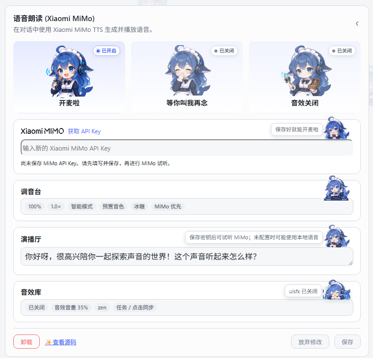
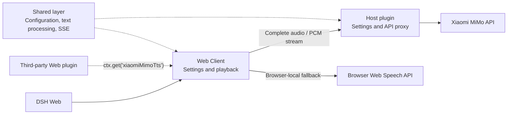

# dsh-xiaomi-tts

[](https://www.npmjs.com/package/dsh-xiaomi-tts)
[](https://github.com/ppy-web/dsh-plugin-xiaomi-mimo-tts)

Add Xiaomi MiMo TTS read-aloud playback to DeepSeek Harness Web.

> Powered by Xiaomi MiMo TTS to turn text into smooth, clear natural speech. MiMo TTS is currently free for a limited time; see the official platform for the latest policy.

<p><a href="README.md"><strong>中文说明 →</strong></a></p>

## 🎨 Preview

| Preset voices | Custom voices |
|:---:|:---:|
|  |  |
| Settings | UI example |
|  |  |

## ✨ Features

- One-click read-aloud: adds a **Read aloud** button to the conversation action bar (enabled by default).
- Built-in voices: uses `mimo-v2.5-tts` for smooth, clear audio with streaming playback.
- Playback speed: adjustable from 0.5× to 2.0× for both MiMo and browser-local speech.
- Custom voices: uses `mimo-v2.5-tts-voicedesign` to create a voice from a text description.
- Browser-local voices: uses offline or online voices provided by the browser host.
- Automatic text cleaning: removes URLs, file paths, code blocks, emoji, icons, and control characters before synthesis.
- Sound Effects: semantic click sounds plus start, success, failure, and pending sounds for the current task.

## 📋 Requirements

- `@deepseek-ai/dsh` `0.1.5-rc.1` (the plugin currently supports this version only)
- Node.js 22+
- Xiaomi MiMo API Key
- [Official TTS API documentation](https://mimo.mi.com/models/zh-CN/mimo-v2.5-tts)

## 🚀 Install and use

- Install from npm **(recommended)**:

```bash
dsh plugin --profile web add dsh-xiaomi-tts
```

- Install from the [DSH plugin marketplace](https://github.com/dsh-market/dsh-market) **(recommended)**:

Open **Settings → Plugin marketplace**, search for `xiaomi-mimo-tts`, and click **Install**.

- Ask DSH or any AI agent to install it for you:

```text
Install the dsh-xiaomi-tts plugin on this computer's DSH.
1. Prefer: dsh plugin --profile web add dsh-xiaomi-tts@latest
2. If that fails, try the source repository: https://github.com/ppy-web/dsh-plugin-xiaomi-mimo-tts
```

- Install from GitHub:

```bash
dsh plugin --profile web add github:ppy-web/dsh-plugin-xiaomi-mimo-tts
```

- Install a `.tgz` downloaded from GitHub Releases:

```powershell
dsh plugin --profile web add "<download-path>/dsh-xiaomi-tts-<version>.tgz"
```

Release tarballs already contain the built files and do not require `pnpm approve-builds`.

After installation, restart `dsh web`, then open **Settings → Plugins → Plugin configuration → Xiaomi MiMo Read Aloud** and [get and enter your API Key](https://platform.xiaomimimo.com/console/api-keys). Standard API Keys and Token Plan-specific API Keys are supported.

Click **Save** after changing any setting.

### Sound Effects

Below **Broadcast Studio** in the voice settings card, control the master switch, volume, sound pack, click sounds, and task sounds, and preview common cues. Sounds are synthesized with browser Web Audio; no network request or audio file persistence is used.

When switching from a local development version to the npm package on Windows, stop DSH Web first and run:

```powershell
.\start\dsh-plugin-reinstall.bat 3.0.3
```

## ⚙️ Configuration

**Official built-in voices (`mimo-v2.5-tts`):**

- Chinese female: `冰糖`, `茉莉`
- Chinese male: `苏打`, `白桦`
- English female: `Mia`, `Chloe`
- English male: `Milo`, `Dean`

Preset voices use streaming playback to reduce the wait before speech starts.

**Custom voices (`mimo-v2.5-tts-voicedesign`)**


Common voice-description templates are provided, and you can edit and save the description directly:

```text
Young adult woman, bright and approachable voice, clear articulation, moderate pace, gentle and restrained emotional tone.
```

**Browser-local fallback speech**

Three strategies are available: **MiMo first** falls back to browser speech when MiMo fails; **Local first** prefers browser speech; **Disable local speech** uses MiMo only. Voices come from the browser Web Speech API. Offline availability and the actual voice list depend on the browser, operating system, and network speech services.

**Read-aloud range**

- **Smart selection**: automatic playback prefers the opening semantic segment, while manual playback reads the full reply. Short replies without a separable segment are read in full.
- **Full mode**: both automatic and manual playback read the full reply.
- **First-segment mode**: both automatic and manual playback read only the opening semantic segment.

Keyboard support is available in the settings panel: press `Tab` to move between controls, use the arrow keys to adjust sliders or switch options, and press `Space` to confirm the focused control.

## 🔌 Third-party plugin integration

This plugin exposes PCM streaming playback for Web plugins. At the point where speech is needed, call:

```ts
ctx.get('xiaomiMimoTts')?.play('Welcome back')
```

Use `ctx.get()` dynamically rather than declaring a required `inject` service. If this plugin is not installed or not ready, the call safely does nothing. `play()` uses the saved MiMo settings for PCM playback, and `stop()` stops it explicitly. New playback interrupts the current read-aloud session.

For TypeScript hints, import the type only:

```ts
import type { XiaomiMimoTtsService } from 'dsh-xiaomi-tts/client-api'

const tts = ctx.get('xiaomiMimoTts') as XiaomiMimoTtsService | undefined
tts?.play('Welcome back')
```

## 🔒 Privacy

- The API Key is stored on the DSH Host and is not sent to the browser.
- The reply body is sent to Xiaomi MiMo when speech is generated.
- Audio is played in browser memory through Web Audio or a temporary Blob URL and is not persisted to disk.
- The sound core is migrated from [uisfx 0.4.0](https://github.com/romainsimon/uisfx) under the MIT License; see `NOTICE`.

## 🏗️ Architecture

- **Shared layer**: common configuration, text cleaning, segmentation, and SSE contract.
- **Host plugin**: manages settings and static assets, and proxies complete-audio and PCM streaming requests to MiMo.
- **Web Client**: provides settings and read-aloud entry points, playback state, browser-speech fallback, and the third-party playback service.



## 🛠️ Development

When editing the settings panel, run:

```bash
pnpm dev
```

This opens a local UI preview shell that renders `src/client/settings-card.tsx` directly with hot updates. It uses in-memory settings and local mock APIs, so it does not call MiMo or uninstall the plugin. Run `pnpm dev:build` to check that the preview shell builds independently.

Run the settings UI lab while editing the panel:

```bash
pnpm dev
```

It opens a local Vite shell that renders `src/client/settings-card.tsx` directly with hot updates, so reinstalling the plugin or restarting DSH is unnecessary. The shell uses in-memory settings and local mock endpoints; it does not call the MiMo API or uninstall the plugin. Use `pnpm dev:build` to verify that the shell also builds on its own.

```bash
pnpm install
pnpm typecheck
pnpm test
pnpm pack:check
```

Use `pnpm build` for normal builds and `pnpm build:debug` when diagnosing the PCM streaming path.

## 🤝 Recommended companion plugins

- [dsh-whale-musume](https://github.com/Sutera-Diffusus/dsh-whale-musume#readme): energetic whale-girl desktop pet.
- [dsh-plugin-uisfx](https://github.com/XanthanL/dsh-plugin-uisfx#readme): semantic UI sound effects.
- [dsh-dream-skin](https://github.com/RevolutionLA/dsh-dream-skin#readme): native skins, wallpapers, accent colors, and theme packs.
