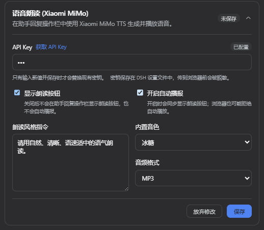
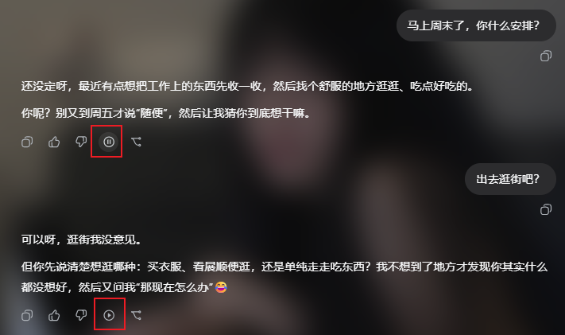

# dsh-xiaomi-tts

<p><a href="README.md"><strong>中文说明 →</strong></a></p>

Xiaomi MiMo text-to-speech controls for finalized assistant messages in DeepSeek Harness Web.

## Preview





## Features

- Adds an optional read-aloud button to the assistant message action strip; it is enabled by default.
- Uses Xiaomi MiMo's official `mimo-v2.5-tts` Chat Completions-compatible API.
- Configures whether to show the read-aloud button, the API key, autoplay, built-in voice, MP3/WAV format, and reading instruction under **Settings → Plugins → Plugin configuration**.
- Keeps the API key on the DSH Host. The browser sends only the response text to a same-origin plugin route.
- Supports pause, resume, regeneration, request errors, and browser autoplay rejection.
- Cleans speech text before sending it to TTS: URLs, file paths, code blocks, emoji, icons, and control characters are removed, and common Chinese punctuation is converted to ASCII punctuation.

Official Xiaomi MiMo TTS reference: <https://mimo.mi.com/static/docs/api/audio/tts.md>

## Install

```bash
dsh plugin --profile web add dsh-xiaomi-tts
```

Restart `dsh web`, then open **Settings → Plugins → Plugin configuration** and save a Xiaomi MiMo API key.

When updating or switching from the local development link to the npm package, stop DSH Web before changing the profile dependencies. This prevents a running Node process from holding the Windows Junction that pnpm needs to replace:

```powershell
.\start\dsh-plugin-reinstall.bat 1.1.2
```

The script stops DSH Web, removes the plugin from the `web` profile, installs the requested npm version, and starts DSH Web again. If you run the steps manually, keep the same order:

```powershell
.\start\dsh-web-stop.bat
dsh plugin --profile web remove dsh-xiaomi-tts
dsh plugin --profile web add dsh-xiaomi-tts@1.1.2
.\start\dsh-web-start.bat
```

The settings include the API key, read-aloud button, automatic read-aloud, voice, audio format, and reading instruction. Both switches are enabled by default; disabling the read-aloud button also disables automatic read-aloud, while enabling automatic read-aloud enables the button.

Browsers may block autoplay. If that happens, click the read-aloud button below a response.

### Speech text preprocessing

Read-aloud uses cleaned text and does not modify the assistant reply shown in the chat. Markdown links keep their readable labels while their targets are removed; URLs, file paths, complete code blocks, emoji, icons, zero-width characters, and control characters are not sent to Xiaomi MiMo. Inline code keeps its text without backticks, consecutive whitespace is collapsed, and common Chinese punctuation is converted to ASCII punctuation.

## Development

```bash
pnpm install
pnpm typecheck
pnpm test
pnpm pack:check
```

## Privacy

- The API key stays on the DSH Host and is never sent to the browser.
- Response text is sent to Xiaomi MiMo when speech is generated.
- Audio is played through a temporary Blob URL and is not persisted to disk.

## License

MIT
