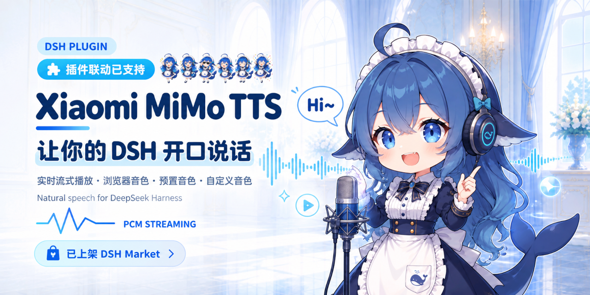
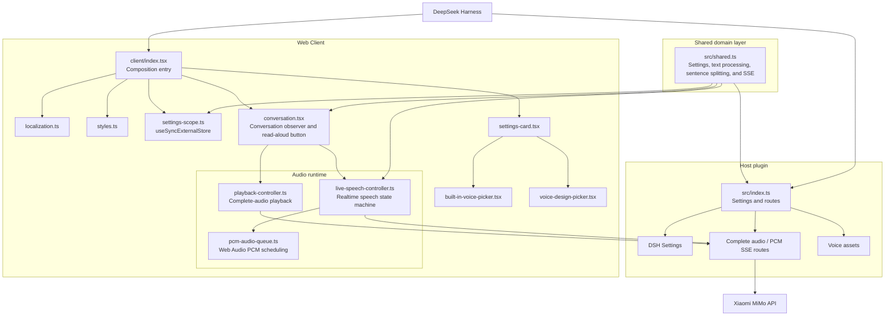

# dsh-xiaomi-tts

[](https://www.npmjs.com/package/dsh-xiaomi-tts)
[](https://github.com/ppy-web/dsh-plugin-xiaomi-mimo-tts)

<p><a href="README.md"><strong>中文说明 →</strong></a></p>

Add Xiaomi MiMo TTS read-aloud playback to assistant replies in DeepSeek Harness Web.

> Powered by Xiaomi MiMo TTS models to turn assistant replies into smooth, clear natural speech. MiMo TTS is currently free for a limited time; refer to Xiaomi MiMo for the current policy.

## Preview


## Features

- Shows a read-aloud button below each completed assistant reply body when needed; enabled by default.
- Uses Xiaomi MiMo's currently limited-time-free TTS models: `mimo-v2.5-tts` outputs smooth, clear audio with selectable PCM streaming or complete MP3/WAV playback.
- Uses `mimo-v2.5-tts-voicedesign` Voice Design to create the voice you want from a text description.
- Lets you switch between the preset-voice model and the custom voice-design model under **Settings → Plugins → Plugin configuration**, and configure the API key, autoplay, voice, audio format, and voice description.
- Presents built-in voices in a two-column selector using Xiaomi MiMo's official avatars, names, and summaries.
- Keeps the API key on the DSH Host. The browser sends only the reply body text to a same-origin Host route.
- Supports pause, resume, regeneration, and autoplay-blocked prompts. Automatic playback only triggers for the latest reply newly completed in the current run; opening messages from history does not play them.
- Aggressively cleans speech text before sending it to TTS: URLs, file paths, code blocks, emoji, icons, and control characters are removed, and common Chinese punctuation is converted to ASCII punctuation.

## Requirements

- `@deepseek-ai/dsh` `0.1.0-rc.7` or a compatible version
- Node.js 22+
- Xiaomi MiMo API Key

Official Xiaomi MiMo TTS API reference: <https://mimo.mi.com/static/docs/api/audio/tts.md>

## Install

Install from npm:

```bash
dsh plugin --profile web add dsh-xiaomi-tts
```

Install from a local directory:

```bash
dsh plugin --profile web add ./dsh-plugin-xiaomi-mimo-tts
```

Install from GitHub:

```bash
dsh plugin --profile web add github:ppy-web/dsh-plugin-xiaomi-mimo-tts
```

After installation, restart `dsh web`, then open **Settings → Plugins → Plugin configuration → Xiaomi MiMo Read Aloud**, enter the API key, and save. The plugin automatically selects the endpoint from the API key prefix: `sk-` uses the standard endpoint and `tp-` uses the Token Plan-compatible endpoint.

When updating or switching from the local development link to the npm package, stop DSH Web before changing the profile dependencies. This prevents a running Node process from holding the Windows Junction that pnpm needs to replace:

```powershell
.\start\dsh-plugin-reinstall.bat 2.3.4
```

The script stops DSH Web, removes the current plugin from the profile, installs the requested npm version, and starts DSH Web again. If you run the steps manually, keep the same order:

```powershell
.\start\dsh-web-stop.bat
dsh plugin --profile web remove dsh-xiaomi-tts
dsh plugin --profile web add dsh-xiaomi-tts@2.3.4
.\start\dsh-web-start.bat
```

## Configuration

Available built-in voices for `mimo-v2.5-tts`:

- Chinese female: `冰糖`, `茉莉`
- Chinese male: `苏打`, `白桦`
- English female: `Mia`, `Chloe`
- English male: `Milo`, `Dean`

Preset voices default to **PCM (streaming)**. A complete reply starts playing as soon as audio chunks arrive, reducing the wait, but pause and resume are unavailable; a failure before the first chunk falls back to MP3. **MP3 (complete audio)** and **WAV (complete audio)** wait for the whole file and support pause and resume. MP3 is smaller, while WAV preserves lossless audio at a larger size.

Custom voice design with `mimo-v2.5-tts-voicedesign`

The plugin provides common voice-description templates. The selector defaults to **Custom**, so users can edit and save the description directly. After switching to another template and back to **Custom**, the previously saved custom content is restored.

```text
Young adult woman, bright and approachable voice, clear articulation, moderate pace, gentle and restrained emotional tone.
```

It is recommended to describe age and gender, vocal texture, speaking pace, and emotional baseline, while avoiding scenes or actions. Preset-voice mode still uses the built-in voice configuration.

Browsers may block autoplay. If that happens, click the read-aloud button first.

### Speech text preprocessing

Read-aloud uses only the cleaned reply body and does not modify the assistant message shown in the chat. Markdown links keep their readable labels while their targets are removed; URLs, file paths, complete code blocks, emoji, icons, zero-width characters, and control characters are not sent to Xiaomi MiMo. Parentheses, brackets, book-title marks, quotation marks, and other non-boundary punctuation are removed; retained sentence-boundary punctuation is converted to ASCII. Only preset voices configured for PCM stream partial replies after accumulating at least 20 speakable characters. Completed replies are sent in one PCM/SSE request and play as chunks arrive. MP3 and WAV always request complete audio.

Complete-audio responses are limited to 32 MiB for MP3 and 128 MiB for WAV by default. Advanced Cordis configuration can override these limits with `maxMp3AudioBytes` and `maxWavAudioBytes`. The Host enforces the response limit before JSON parsing and Base64 decoding.

## Privacy

- The API key stays on the DSH Host and is never sent to the browser.
- Reply text is sent to Xiaomi MiMo when speech is generated.
- Audio stays in browser memory and is played through Web Audio or a temporary Blob URL; it is not persisted to disk.

## Feedback and support

Please use [GitHub Issues](https://github.com/ppy-web/dsh-plugin-xiaomi-mimo-tts/issues) for bug reports, feature requests, or feedback.

## Architecture

- `src/index.ts`: Host entry; registers Schemastery settings, both voice-asset groups, and complete-audio plus PCM/SSE synthesis routes.
- `src/shared.ts`: Shared Host/Client domain contracts, including settings types, defaults, text cleaning, sentence splitting, stream batching, and SSE parsing.
- `src/client/index.tsx`: Web Client composition entry; binds DSH services, registers slots, injects styles, and owns controller lifecycles.
- `src/client/conversation.tsx`: React conversation adapter; observes DSH conversation snapshots and renders read-aloud actions.
- `src/client/settings-card.tsx`, `built-in-voice-picker.tsx`, and `voice-design-picker.tsx`: Plugin settings form, official built-in voice panel, and Voice Design voice selector UI.
- `src/client/live-speech-controller.ts`, `pcm-audio-queue.ts`, and `playback-controller.ts`: Realtime speech state machine, Web Audio PCM scheduling, and complete-audio playback.
- `src/client/settings-scope.ts`: Connects the DSH Settings Scope to React safely with `useSyncExternalStore`.



## Development

```bash
pnpm install
pnpm typecheck
pnpm test
pnpm pack:check
```

`lib/` is generated output and is not committed during day-to-day development. Feature commits update source and tests only; when a version is packaged or published, `prepack` regenerates the release output. GitHub installs build it during installation through `prepare`.

## License

MIT
