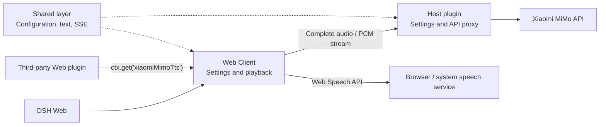

# dsh-xiaomi-tts

[](https://www.npmjs.com/package/dsh-xiaomi-tts)
[](https://www.npmjs.com/package/dsh-xiaomi-tts)


Add Xiaomi MiMo TTS read-aloud, browser-local fallback speech, and optional UI sounds to DSH Web.

> MiMo TTS availability and pricing may change. Check the official Xiaomi MiMo platform for the current policy.

<p><a href="README.md"><strong>中文说明 →</strong></a></p>

## 🎨 Preview

- [Open the settings page preview](https://ppy-web.github.io/dsh-plugin-xiaomi-mimo-tts)
- QQ discussion group: `1104616387`

| Settings | Message action |
|:---:|:---:|
|  |  |

## ✨ Features

- One-click read-aloud action on assistant messages.
- Low-latency PCM streaming for `mimo-v2.5-tts`, with complete-audio or browser-speech fallback when appropriate.
- Official built-in voices and text-described custom voices through `mimo-v2.5-tts-voicedesign`.
- MiMo-first, local-first, or MiMo-only speech strategies.
- Smart, full, and first-segment read-aloud ranges.
- 0.5×–2.0× playback speed, voice volume, pause, resume, and stop controls.
- Text preparation that removes URLs, paths, code blocks, emoji, and control characters before synthesis.
- Optional task and semantic click sounds, disabled by default.
- An optional PCM playback service for other DSH Web plugins.
- A Whale Girl Agent preset: a whale maid for conversation, companionship, light humor, and local memory tools.

## 📋 Requirements

- `@deepseek-ai/dsh` `0.2.0-rc.2` (the current target; compatible with `0.1.7-rc.1` through `0.2.x` releases)
- Node.js 22+
- A Xiaomi MiMo API key for MiMo speech
- [Official TTS API documentation](https://mimo.mi.com/models/zh-CN/mimo-v2.5-tts)

## 🚀 Installation

### Official installation (desktop/web) (recommended)

Open the desktop or web client, go to the Plugin Manager, and search for `dsh-xiaomi-tts`.


### Install from npm (web)

```bash
dsh plugin --profile web add dsh-xiaomi-tts@latest
```

### Install from the DSH Plugin Manager

The plugin is published to npm. In DSH Web's sidebar, open the Plugin Manager, choose **Add plugin**, then search for `dsh-xiaomi-tts`.

### Install from the plugin marketplace

 The [plugin marketplace](https://awesome-dsh-plugin.com) includes this plugin. If you have the community marketplace installed, search for `xiaomi-mimo-tts` under **Settings → Plugin marketplace**.

**Sidebar → Plugins → dsh-xiaomi-tts → Text To Speech (MiMo TTS)**

## 🐋 First use

New installations start with:

- the manual Read aloud action available;
- **automatic playback disabled**;
- **UI sound effects disabled**;
- browser-local fallback available under the default MiMo-first strategy, even before a MiMo key is saved.

Recommended setup order:

1. [Create a Xiaomi MiMo API key](https://platform.xiaomimimo.com/console/api-keys).
2. Enter it in the plugin settings and click **Save**.
3. Open Mixing Console and choose a model and voice.
4. Test it in Broadcast Studio.
5. Enable automatic playback and UI sounds only if wanted, then save again.

## ⚙️ Configuration

### Official built-in voices

`mimo-v2.5-tts` currently provides:

- Chinese female: `冰糖`, `茉莉`
- Chinese male: `苏打`, `白桦`
- English female: `Mia`, `Chloe`
- English male: `Milo`, `Dean`

### Custom voices

`mimo-v2.5-tts-voicedesign` generates a voice from a description. The settings panel includes presets and an editable custom description:

### Browser-local speech

- **MiMo first**: tries browser speech if MiMo fails before audio starts.
- **Local first**: uses browser speech first, then tries MiMo if local speech fails.
- **Disable local speech**: uses MiMo only.

Browser voices come from the Web Speech API. Offline availability, language coverage, and actual voice output depend on the browser, operating system, and their speech services.

### Read-aloud range

- **Smart mode**: automatic playback prefers the opening semantic segment and may add a short closing cue when substantial text remains. Manual playback reads the full reply.
- **Full mode**: automatic and manual playback both read the full reply.
- **First-segment mode**: automatic and manual playback both read only the opening segment.

Opening segments and synthesis chunks split between complete sentences; an individual long sentence may exceed the recommended chunk size. Streaming playback waits for a sentence boundary before locking the opening segment, so reaching the character threshold does not cut a sentence short.

The settings panel supports keyboard navigation: use `Tab` to move focus, arrow keys to adjust sliders and options, and `Space` to activate buttons and switches.

## 🔌 Third-party plugin integration


The plugin exposes an optional PCM streaming service to Web plugins:

```ts
ctx.get('xiaomiMimoTts')?.play('Welcome back')
```

Use `ctx.get()` dynamically instead of declaring a required injection. The call safely does nothing when the plugin is missing, unavailable, or disabled. New playback interrupts the current read-aloud session, and `stop()` stops it explicitly.

For TypeScript types:

```ts
import type { XiaomiMimoTtsService } from 'dsh-xiaomi-tts/client-api'

const tts = ctx.get('xiaomiMimoTts') as XiaomiMimoTtsService | undefined
tts?.play('Welcome back')
```

## 🐳 Whale Girl Agent preset

After installing this plugin, choose **Whale Girl** (`鲸鱼娘`) from the Agent preset list when creating a session. She is a conversation assistant and whale-maid companion: she responds to the user's situation first, then helps organize tasks, explain information, or use tools. She can also send contextual CDN-linked meme images without an external meme plugin. Her humor is light and contextual, with occasional rice, tail, and work jokes rather than constant roleplay.

The persona and meme cues are informed by the community [DeepSeek-chan Meme Pack](https://github.com/the-beating-light-of-the-nail/deepseek-chan-meme-pack). Images are displayed through public CDN hotlinks; this package does not redistribute that repository's image assets.

Whale Girl can hotlink that pack's public WebP CDN images with standard Markdown image syntax. She uses compressed previews by default and only uses full-size URLs when the user asks for the original.

File access, file search, and Windows PowerShell are for user-authorized tasks and non-sensitive local memory only. The maid role does not imply real-world control or absolute obedience; unsafe, illegal, privacy-invasive, and dangerous requests still follow the host safety rules.

## 🔒 Privacy and network access

- The DSH Host stores the API key. The browser reads only whether a key is configured and whether its prefix is recognized, not the secret itself.
- Browser-local speech uses the Web Speech API. Voices marked online may send text to browser, operating-system, or network speech services.
- Generated MiMo audio is saved in this browser's IndexedDB. Settings → Audio history supports replay, download, deletion, and clearing, including after a page refresh. The latest 100 entries / 100 MB are retained, with oldest entries removed when full. Records include audio and up to 500 characters of text, never API keys.
- Streaming PCM is saved as 24 kHz mono WAV. Streaming batches and generated segments appear separately; only successfully completed generation requests are saved, so cancelled or failed streams are not presented as complete audio. Web Speech API speech has no exportable audio file. Replay and download do not call MiMo again. History belongs to this browser and site address, does not sync across devices, and is removed when site data is cleared. If browser storage is unavailable or full, the list warns that it lasts only for the current visit.
- The sound core is migrated from [uisfx 0.4.0](https://github.com/romainsimon/uisfx) under the MIT License; see `NOTICE`.

## 🏗️ Architecture

- **Shared layer**: defaults, text processing, segmentation, SSE, and playback contracts.
- **Host plugin**: settings and static assets, plus complete-audio and PCM streaming proxies for MiMo.
- **Web Client**: settings, message actions, browser-speech fallback, previews, and the optional third-party playback service.


```mermaid
flowchart LR
    DSH["DSH Web"] --> CLIENT["Web Client<br/>Settings and playback"]
    THIRD["Third-party Web plugin"] -. "ctx.get('xiaomiMimoTts')" .-> CLIENT
    CLIENT -->|"Complete audio / PCM stream"| HOST["Host plugin<br/>Settings and API proxy"]
    HOST --> MIMO["Xiaomi MiMo API"]
    CLIENT -->|"Web Speech API"| SPEECH["Browser / system speech service"]
    SHARED["Shared layer<br/>Configuration, text, SSE"] -.-> CLIENT
    SHARED -.-> HOST
```

## 🛠️ Development

```bash
pnpm install
pnpm dev
```

`pnpm dev` starts the local UI Lab and renders `src/client/settings/card.tsx` directly. Saving, remote speech, and update checks are mocked locally; the preview does not call the real MiMo service.

Common checks:

```bash
pnpm typecheck
pnpm test
pnpm dev:build
pnpm pack:check
```

- `pnpm build`: normal build.
- `pnpm build:debug`: build with PCM-path debug logging enabled.
- `pnpm profile:check`: verify the installation in the local DSH Web profile.

On Windows, stop DSH Web before replacing a local development link with the npm package so the running Node process does not hold the Junction:

```powershell
.\start\dsh-plugin-reinstall.bat 3.0.8
```

For a DSH Desktop profile, close Desktop and remove a stale local link with:

```powershell
.\start\dsh-plugin-uninstall-local-link.bat desktop
```

## 🤝 Recommended

> The Whale Maid artwork is inspired by community projects and generated with GPT.
> The UI sound effects reference the implementation in `dsh-plugin-uisfx`.

- [dsh-deep-whale](https://github.com/Small-tailqwq/dsh-deep-whale#readme): Whale Maid theme and skin series.
- [dsh-whale-musume](https://github.com/Sutera-Diffusus/dsh-whale-musume#readme): energetic Whale Maid desktop companion.
- [dsh-plugin-uisfx](https://github.com/XanthanL/dsh-plugin-uisfx#readme): semantic UI sound effects.
- [dsh-dream-skin](https://github.com/RevolutionLA/dsh-dream-skin#readme): native skins, wallpapers, accent colors, and theme packs.
- [dsh-TUI](https://github.com/ccch1mneyyy/dsh-TUI): a plugin for the dsh-TUI ecosystem.
