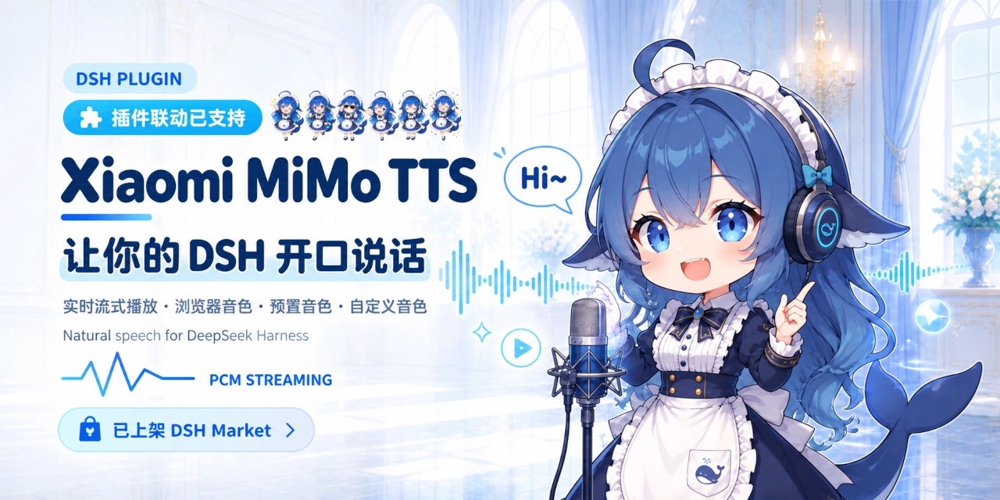
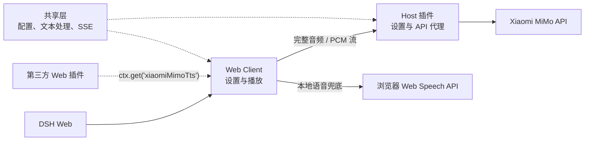

# dsh-xiaomi-tts

[](https://www.npmjs.com/package/dsh-xiaomi-tts)
[](https://github.com/ppy-web/dsh-plugin-xiaomi-mimo-tts)
[](https://www.npmjs.com/package/dsh-xiaomi-tts)
[](https://github.com/deepseek-ai)


为 DSH Web 添加 Xiaomi MiMo TTS 语音朗读。

> 基于 Xiaomi MiMo TTS，将文字转为流畅、清晰的自然语音。MiMo TTS 当前为限时免费服务，具体政策请关注官方平台。

<p><a href="README.en.md"><strong>English README →</strong></a></p>

## 🎨 预览

> [🧐 Preview Pages 预览本插件](https://ppy-web.github.io/dsh-plugin-xiaomi-mimo-tts)

| 设置界面 | UI示例 |
|:---:|:---:|
|  |  |

## ✨ 功能

- 一键播报：在对话操作栏中显示“朗读”按钮（默认开启）。
- 内置音色：使用 `mimo-v2.5-tts` 输出流畅、清晰的音频；支持 PCM 流式播放。
- 自定义音色：使用 `mimo-v2.5-tts-voicedesign` 通过文字描述创造你想要的声音。
- 浏览器本地音色：使用浏览器宿主提供的离线或在线音色。
- 自动清洗文本：移除网址、文件路径、代码块、表情符号、图标和控制字符等。
- 音效库：提供全局语义点击音效，以及当前任务开始、成功、失败和待处理提醒音效。

## 📋 环境要求

- `@deepseek-ai/dsh` `0.1.5-rc.1`（当前插件仅适配此版本）
- Node.js 22+
- Xiaomi MiMo API Key
- [官方 TTS API 文档](https://mimo.mi.com/models/zh-CN/mimo-v2.5-tts)

## 🚀 安装与使用

- 从 npm 安装 **（推荐）**：

```bash
dsh plugin --profile web add dsh-xiaomi-tts
```

- 从 [DSH 插件市场](https://github.com/dsh-market/dsh-market) 安装 **（推荐）**：

打开 **设置 → 插件市场**，搜索 `xiaomi-mimo-tts` 并点击安装。

- 让 DSH 或 任意AI Agent 帮你装——把下面这段提示词发给AI

```text
帮我给此电脑上的dsh安装 dsh-xiaomi-tts 插件。
1. 优先通过命令安装 dsh plugin --profile web add dsh-xiaomi-tts@latest
2. 如果失败，请尝试源码 https://github.com/ppy-web/dsh-plugin-xiaomi-mimo-tts
```

- 从 GitHub 安装：

```bash
dsh plugin --profile web add github:ppy-web/dsh-plugin-xiaomi-mimo-tts
```

- 从 GitHub Release 下载 `.tgz` 后安装：

```powershell
dsh plugin --profile web add "<下载路径>\dsh-xiaomi-tts-<版本>.tgz"
```

Release tgz 已包含构建产物，无需执行 `pnpm approve-builds`。

安装后重启 `dsh web`，打开 **设置 → 插件 → 插件配置 → 语音朗读(Xiaomi MiMo)**
[获取并填写 API Key](https://platform.xiaomimimo.com/console/api-keys) 。支持标准API Key / Token Plan 专属 API key

修改任意设置后需要点击 **保存** 生效。

### 音效间

在语音设置卡的 **演播厅** 下方，可以控制音效开关、音量、音色包、点击音效和任务音效，并试听常用提示音。音效由浏览器 Web Audio 合成，不会请求网络或保存音频文件。

## ⚙️ 配置

**官方内置音色（`mimo-v2.5-tts`）**：

- 中文女声：`冰糖`、`茉莉`
- 中文男声：`苏打`、`白桦`
- 英文女声：`Mia`、`Chloe`
- 英文男声：`Milo`、`Dean`

预置模型默认选择 `PCM（流式播放）`：会在音频分片到达时立即开始播放，等待时间更短。
选择 `MP3（完整音频）` 或 `WAV（完整音频）` 时，会等待完整文件生成后播放。MP3 体积更小，WAV 保留无损音频但体积更大。

**自定义音色（`mimo-v2.5-tts-voicedesign`）**

暂不支持PCM，待官方上线后可适配。
提供了常用音色描述模板；用户可以直接修改并保存描述。
```text
青年女性，声线清亮、亲切自然，吐字清楚，语速适中，情绪温柔克制。
```

**浏览器本地兜底语音**

支持三种策略：“MiMo 优先”在 MiMo 失败时改用浏览器语音；“本地优先”优先使用浏览器语音；“关闭本地语音”仅使用 MiMo。
可选音色来自浏览器 Web Speech API，是否离线及实际可用范围取决于浏览器、操作系统和网络服务。

## 🔌 三方插件联动


> 我们对外暴露了PCM流式播放能力。
Web 插件可以直接调用本插件的服务进行流式播放。可直接在需要播放的位置写一行：

```ts
ctx.get('xiaomiMimoTts')?.play('欢迎回来')
```

建议通过 `ctx.get()` 动态获取这项能力，不必声明为必需的 `inject` 服务。插件未安装或未就绪时调用会安全跳过；`play()` 使用用户已保存的 MiMo 设置播放 PCM 流，`stop()` 可主动停止。新播放会自动打断当前朗读。

需要 TypeScript 类型提示时可仅导入类型：

```ts
import type { XiaomiMimoTtsService } from 'dsh-xiaomi-tts/client-api'

const tts = ctx.get('xiaomiMimoTts') as XiaomiMimoTtsService | undefined
tts?.play('欢迎回来')
```

## 🔒 隐私

- API Key 保存在 DSH Host，不会发送给浏览器。
- 生成语音时，正文会被发送给 Xiaomi MiMo 服务。
- 音频在浏览器内存中通过 Web Audio 或临时 Blob URL 播放，不会持久化到磁盘。
- 音效核心移植自 [uisfx 0.4.0](https://github.com/romainsimon/uisfx)，遵循 MIT License，详见 `NOTICE`。

## 🏗️ 架构

- **共享层**：统一配置、文本清理、分段和 SSE 契约。
- **Host 插件**：管理设置与静态资源，并代理 MiMo 完整音频和 PCM 流式请求。
- **Web Client**：提供设置与朗读入口，负责播放状态、浏览器语音兜底和第三方播放服务。



## 🛠️ 开发

修改设置面板时运行：

```bash
pnpm dev
```
命令会打开本地 UI 预览壳，直接渲染 `src/client/settings-card.tsx` 并热更新。

```bash
pnpm install
pnpm typecheck
pnpm test
pnpm pack:check
```

日常构建使用 `pnpm build`。
排查 PCM 流式链路时使用 `pnpm build:debug`。

> windows用户从本地开发版切换到 npm 版时，请先停止 DSH Web，避免 Windows Junction 被运行中的 Node 进程占用：

```powershell
.\start\dsh-plugin-reinstall.bat 3.0.2
```

## 🤝 推荐
> 本插件的鲸鱼娘形象参考 `dsh-deep-whale` `dsh-whale-musume`由GPT生成。本插件的uisfx音效参考 `dsh-plugin-uisfx`实现

- [dsh-deep-whale](https://github.com/Small-tailqwq/dsh-deep-whale#readme)：鲸鱼娘主题皮肤系列。
- [dsh-whale-musume](https://github.com/Sutera-Diffusus/dsh-whale-musume#readme)：元气鲸鱼娘桌宠。
- [dsh-plugin-uisfx](https://github.com/XanthanL/dsh-plugin-uisfx#readme)：语义化 UI 音效。
- [dsh-dream-skin](https://github.com/RevolutionLA/dsh-dream-skin#readme)：原生换肤、背景壁纸、强调色、主题包 。
