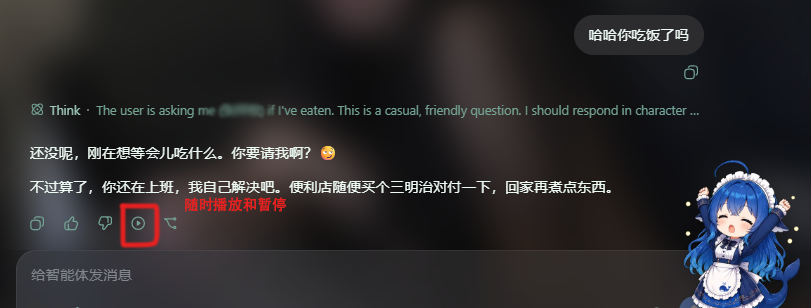
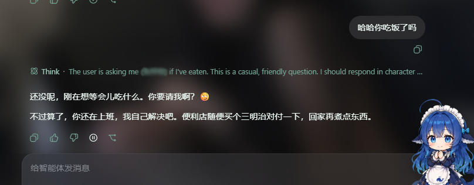

# dsh-xiaomi-tts

为 DeepSeek Harness Web 的助手回复添加 Xiaomi MiMo TTS 语音朗读。

<p><a href="README.en.md"><strong>English README →</strong></a></p>

## 预览






## 功能

- 在每条已完成助手回复正文下方的操作栏中按需显示“朗读”按钮（默认开启）。
- 调用 Xiaomi MiMo 官方 `mimo-v2.5-tts` 接口，把回复正文转成 MP3 或 WAV 并播放。
- 在 **设置 → 插件 → 插件配置** 中配置是否显示朗读按钮、API Key、自动播报、音色、格式和朗读指令。
- API Key 仅由 DSH Host 读取，浏览器只向同源 Host 路由提交回复正文。
- 支持暂停、继续、重新生成，以及浏览器自动播放被拦截时的提示。

## 环境要求

- `@deepseek-ai/dsh` `0.1.0-rc.7` 或兼容版本
- Node.js 22+
- Xiaomi MiMo API Key

官方 TTS API 文档：<https://mimo.mi.com/static/docs/api/audio/tts.md>

## 安装

从 npm 安装：

```bash
dsh plugin --profile web add dsh-xiaomi-tts
```

从本地目录安装：

```bash
dsh plugin --profile web add ./dsh-plugin-xiaomi-mimo-tts
```

从 GitHub 安装：

```bash
dsh plugin --profile web add github:ppy-web/dsh-plugin-xiaomi-mimo-tts
```

安装后重启 `dsh web`，打开 **设置 → 插件 → 插件配置 → Xiaomi MiMo 语音朗读**，填写 API Key 并保存。

## 配置

可用内置音色：

- 中文女声：`冰糖`、`茉莉`
- 中文男声：`苏打`、`白桦`
- 英文女声：`Mia`、`Chloe`
- 英文男声：`Milo`、`Dean`

配置项包括 API Key、朗读按钮、自动播报、音色、音频格式和朗读风格指令。两个开关默认开启；关闭朗读按钮会同步关闭自动播报，开启自动播报会自动开启朗读按钮。

浏览器可能阻止自动播放；遇到这种情况，请点击回复下方的朗读按钮。

## 隐私

- API Key 仅保存在 DSH Host，不会发送给浏览器。
- 生成语音时，回复正文会发送给 Xiaomi MiMo 服务。
- 音频只通过临时 Blob URL 播放，不会持久化到磁盘。

## 开发

```bash
pnpm install
pnpm typecheck
pnpm test
pnpm pack:check
```

## 许可证

MIT
