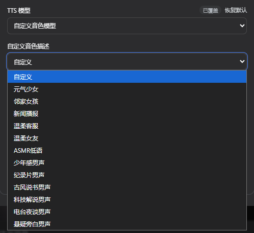

# dsh-xiaomi-tts

为 DeepSeek Harness Web 的助手回复添加 Xiaomi MiMo TTS 语音朗读。

<p><a href="README.en.md"><strong>English README →</strong></a></p>

## 预览





## 功能

- 在每条已完成助手回复正文下方的操作栏中按需显示“朗读”按钮（默认开启）。
- 调用 Xiaomi MiMo 官方 `mimo-v2.5-tts` 或 `mimo-v2.5-tts-voicedesign` 接口，把回复正文转成 MP3 或 WAV 并播放。
- 在 **设置 → 插件 → 插件配置** 中切换预置音色/自定义音色模型，配置 API Key、自动播报、音色、音色描述和格式。
- API Key 仅由 DSH Host 读取，浏览器只向同源 Host 路由提交回复正文。
- 支持暂停、继续、重新生成，以及浏览器自动播放被拦截时的提示。
- 发送给 TTS 前会积极清理朗读文本：移除网址、文件路径、代码块、表情符号、图标和控制字符，并将常规中文标点转换为英文标点。

## 环境要求

- `@deepseek-ai/dsh` `0.1.0-rc.7` 或兼容版本
- Node.js 22+
- Xiaomi MiMo API Key

官方 TTS API 文档：<https://mimo.mi.com/static/docs/api/audio/tts.md>

## 安装

从 npm 安装：

```bash
dsh plugin --profile web add dsh-xiaomi-tts
```

从本地目录安装：

```bash
dsh plugin --profile web add ./dsh-plugin-xiaomi-mimo-tts
```

从 GitHub 安装：

```bash
dsh plugin --profile web add github:ppy-web/dsh-plugin-xiaomi-mimo-tts
```

安装后重启 `dsh web`，打开 **设置 → 插件 → 插件配置 → Xiaomi MiMo 语音朗读**，填写 API Key 并保存。

更新或从本地开发版切换到 npm 版时，必须先停止 DSH Web，避免 Windows Junction 被运行中的 Node 进程占用：

```powershell
.\start\dsh-plugin-reinstall.bat 2.0.0
```

这个脚本会按顺序停止 DSH Web、卸载当前 profile 中的插件、从 npm 安装指定版本并重新启动 DSH Web。若手动操作，请保持相同顺序：

```powershell
.\start\dsh-web-stop.bat
dsh plugin --profile web remove dsh-xiaomi-tts
dsh plugin --profile web add dsh-xiaomi-tts@2.0.0
.\start\dsh-web-start.bat
```

## 配置

可用内置音色（`mimo-v2.5-tts`）：

- 中文女声：`冰糖`、`茉莉`
- 中文男声：`苏打`、`白桦`
- 英文女声：`Mia`、`Chloe`
- 英文男声：`Milo`、`Dean`

切换到 `mimo-v2.5-tts-voicedesign` 后，插件不会发送 `audio.voice`，而是把“自定义音色描述”作为上游 `user` 消息，把回复正文作为 `assistant` 消息发送。音色描述建议写成一到两句，只描述声音本身，例如：

设置卡提供参考页中的常用音色描述模板；下拉框默认选择“自定义”，用户可以直接修改并保存描述。切换到其他模板后再切回“自定义”时，会恢复之前保存的自定义内容。

```text
青年女性，声线清亮、亲切自然，吐字清楚，语速适中，情绪温柔克制。
```

建议包含年龄段与性别、声音质感、语速节奏和情绪底色，不写场景或动作。预置音色模式仍使用原来的内置音色配置。

配置项包括 API Key、朗读按钮、自动播报、模型、内置音色、音色描述和音频格式。两个开关默认开启；关闭朗读按钮会同步关闭自动播报，开启自动播报会自动开启朗读按钮。

浏览器可能阻止自动播放；遇到这种情况，请点击回复下方的朗读按钮。

### 朗读文本处理

朗读只使用清理后的正文，不会修改聊天记录中显示的助手回复。Markdown 链接会保留可读标题并删除链接地址；网址、文件路径、完整代码块、表情符号、图标、零宽字符和控制字符不会发送给 Xiaomi MiMo。行内代码保留文字内容但去除反引号，连续空白会合并，常规中文标点会转换为 ASCII 英文标点。

## 隐私

- API Key 仅保存在 DSH Host，不会发送给浏览器。
- 生成语音时，回复正文会发送给 Xiaomi MiMo 服务。
- 音频只通过临时 Blob URL 播放，不会持久化到磁盘。

## 开发

```bash
pnpm install
pnpm typecheck
pnpm test
pnpm pack:check
```

## 许可证

MIT
