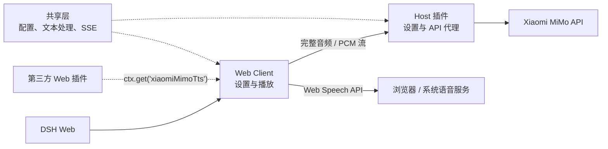

# dsh-xiaomi-tts

[](https://www.npmjs.com/package/dsh-xiaomi-tts)
[](https://www.npmjs.com/package/dsh-xiaomi-tts)


为 DSH Web 添加 Xiaomi MiMo TTS 语音朗读、浏览器本地语音兜底和可选 UI 音效。

> MiMo TTS 当前可能处于限时免费或调整计费阶段，请以 Xiaomi MiMo 官方平台的最新政策为准。

<p><a href="README.en.md"><strong>English README →</strong></a></p>

## 🎨 预览

- [在线打开 Preview Pages](https://ppy-web.github.io/dsh-plugin-xiaomi-mimo-tts)

| 设置界面 | 对话朗读入口 |
|:---:|:---:|
|  |  |

## ✨ 功能

- 一键朗读：在助手消息操作栏中提供“朗读”按钮。
- 低延迟播放：`mimo-v2.5-tts` 支持 PCM 流式播放，并在必要时回退到完整音频或浏览器语音。
- 内置与自定义音色：支持官方内置音色，以及 `mimo-v2.5-tts-voicedesign` 音色描述。
- 浏览器本地语音：可选择 MiMo 优先、本地优先或仅使用 MiMo。
- 朗读范围：支持智能、全文和首段模式。
- 播放控制：支持 0.5×–2.0× 语速、语音音量、暂停、继续和停止。
- 文本清洗：朗读前移除网址、路径、代码块、表情符号和控制字符等不适合播报的内容。
- 演播厅：试听时明确显示正在使用 MiMo 还是浏览器本地语音，并区分常见失败原因。
- 可选音效：提供任务状态和语义化点击音效，默认关闭。
- 插件联动：向其他 DSH Web 插件暴露可选的 PCM 播放服务。

## 📋 环境要求

- `@deepseek-ai/dsh` `0.1.7-alpha.2`（当前兼容目标版本）
- Node.js 22+
- 使用 MiMo 语音时需要 Xiaomi MiMo API Key
- [官方 TTS API 文档](https://mimo.mi.com/models/zh-CN/mimo-v2.5-tts)

## 🚀 安装

### 从 npm 安装（推荐）

```bash
dsh plugin --profile web add dsh-xiaomi-tts@latest
```

### 从插件市场安装

当前 DSH 插件市场已收录本插件，可在 **设置 → 插件市场** 中搜索 `xiaomi-mimo-tts`。

### 从 GitHub 安装

```bash
dsh plugin --profile web add github:ppy-web/dsh-plugin-xiaomi-mimo-tts
```

也可以下载 GitHub Release 中的 `.tgz`：

```powershell
dsh plugin --profile web add "<下载路径>\dsh-xiaomi-tts-<版本>.tgz"
```

Release 压缩包已包含构建产物，无需执行 `pnpm approve-builds`。

安装完成后，重启正在运行的 DSH Web `web` profile，然后打开：

**侧边栏 → 插件 → dsh-xiaomi-tts → 语音朗读 (Xiaomi MiMo)**

## 🐋 首次使用

新安装的默认行为：

- 朗读按钮可用；
- **自动播报默认关闭**；
- **UI 音效默认关闭**；
- 未保存 API Key 时，“MiMo 优先”策略可能回退到浏览器本地语音。

推荐配置顺序：

1. [获取 Xiaomi MiMo API Key](https://platform.xiaomimimo.com/console/api-keys)。
2. 在插件设置中输入 Key，并点击底部 **保存**。
3. 打开“调音台”，选择模型和音色。
4. 在“演播厅”试听；状态气泡会显示实际使用的是 MiMo 还是浏览器本地语音。
5. 按需开启自动播报和 UI 音效，再次保存。

> 新输入的 API Key 只有保存到 DSH Host 后才会用于 MiMo 试听。界面中的 `sk-` / `tp-` 检查只是格式识别，不代表服务端已经验证密钥有效。

### 更换或清除 API Key

- 输入新 Key 并保存，会替换当前个人设置层的密钥。
- 点击 **清除** 并保存，会移除当前用户层覆盖。
- 如果 DSH 基础配置仍提供密钥，清除个人覆盖后会恢复继承该密钥；因此该操作不等同于撤销 Xiaomi 平台上的密钥。
- 如需彻底失效，请同时前往 Xiaomi MiMo 控制台撤销对应 Key。

## ⚙️ 配置说明

### 官方内置音色

`mimo-v2.5-tts` 当前提供：

- 中文女声：`冰糖`、`茉莉`
- 中文男声：`苏打`、`白桦`
- 英文女声：`Mia`、`Chloe`
- 英文男声：`Milo`、`Dean`

### 自定义音色

`mimo-v2.5-tts-voicedesign` 支持从音色描述生成声音。设置面板包含预设模板，也可以手动编辑：

```text
青年女性，声线清亮、亲切自然，吐字清楚，语速适中，情绪温柔克制。
```

音色描述支持预设模板，也可以直接手动编辑；修改后需要保存设置。

### 浏览器本地语音

- **MiMo 优先**：MiMo 在首段音频开始前失败时，尝试浏览器语音。
- **本地优先**：先使用浏览器语音，失败后尝试 MiMo。
- **关闭本地语音**：只使用 MiMo，不进行本地兜底。

浏览器音色来自 Web Speech API。是否离线、可用语言和实际声音取决于浏览器、操作系统及其语音服务。

### 朗读范围

- **智能模式**：自动播报优先朗读首个语义段；未读内容较多时可能补一句收尾提示。手动朗读播放全文。
- **全文模式**：自动播报和手动朗读都播放全文。
- **首段模式**：自动播报和手动朗读都只播放首个语义段。

设置面板支持键盘操作：使用 `Tab` 移动焦点，方向键调整滑块或选项，空格键确认按钮和开关。

## 🔌 三方插件联动

本插件向 Web 插件提供可选 PCM 流式播放能力：

```ts
ctx.get('xiaomiMimoTts')?.play('欢迎回来')
```

建议通过 `ctx.get()` 动态获取，不要声明为必需注入。插件未安装、未就绪或已关闭时，调用会安全跳过；新播放会中断当前朗读，`stop()` 可主动停止。

需要 TypeScript 类型时：

```ts
import type { XiaomiMimoTtsService } from 'dsh-xiaomi-tts/client-api'

const tts = ctx.get('xiaomiMimoTts') as XiaomiMimoTtsService | undefined
tts?.play('欢迎回来')
```

## 🔒 隐私与网络访问

- API Key 由 DSH Host 保存，浏览器只读取“是否已配置/格式是否识别”的状态，不读取密钥正文。
- 生成 MiMo 语音时，待朗读正文和相关音色指令会发送至 Xiaomi MiMo 服务。
- 浏览器本地语音由 Web Speech API 提供；标记为在线的音色可能把文本交给浏览器、操作系统或其网络语音服务。
- 展开设置卡片时，DSH Host 会访问 npm Registry 检查是否存在新版本。
- 音频在浏览器内存中通过 Web Audio 或临时 Blob URL 播放，插件不会主动持久化音频文件。
- 音效核心移植自 [uisfx 0.4.0](https://github.com/romainsimon/uisfx)，遵循 MIT License，详见 `NOTICE`。

## 🏗️ 架构

- **共享层**：配置默认值、文本处理、分段、SSE 和播放契约。
- **Host 插件**：注册设置与静态资源，并代理 MiMo 完整音频和 PCM 流式请求。
- **Web Client**：提供设置、消息朗读、浏览器语音兜底、试听和第三方播放服务。



## 🛠️ 开发

```bash
pnpm install
pnpm dev
```

`pnpm dev` 会启动本地 UI Lab，直接渲染 `src/client/settings/card.tsx`。设置保存、远程语音和版本检查使用本地 mock，不会调用真实 MiMo 服务。

常用检查：

```bash
pnpm typecheck
pnpm test
pnpm dev:build
pnpm pack:check
```

- `pnpm build`：正常构建。
- `pnpm build:debug`：启用 PCM 链路调试日志的构建。
- `pnpm profile:check`：验证本机 DSH Web profile 中的安装状态。

Windows 从本地开发链接切换到 npm 包前，请先停止 DSH Web，避免运行中的 Node 进程占用 Junction：

```powershell
.\start\dsh-plugin-reinstall.bat 3.0.5-alpha
```

## 🤝 推荐插件

> 本插件的鲸鱼娘形象参考 `dsh-deep-whale` `dsh-whale-musume`由GPT生成。本插件的uisfx音效参考 `dsh-plugin-uisfx`实现

- [dsh-deep-whale](https://github.com/Small-tailqwq/dsh-deep-whale#readme)：鲸鱼娘主题皮肤系列。
- [dsh-whale-musume](https://github.com/Sutera-Diffusus/dsh-whale-musume#readme)：元气鲸鱼娘桌宠。
- [dsh-plugin-uisfx](https://github.com/XanthanL/dsh-plugin-uisfx#readme)：语义化 UI 音效。
- [dsh-dream-skin](https://github.com/RevolutionLA/dsh-dream-skin#readme)：原生换肤、背景壁纸、强调色和主题包。
