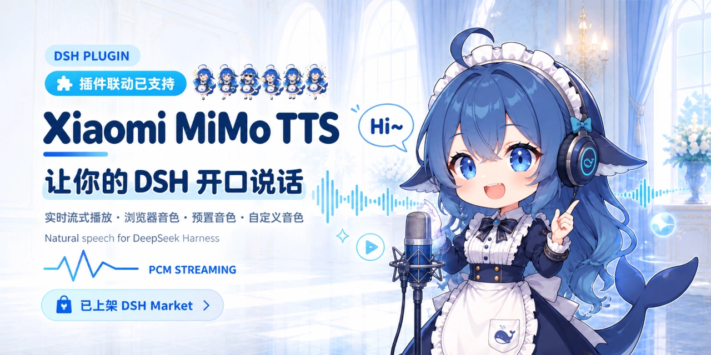
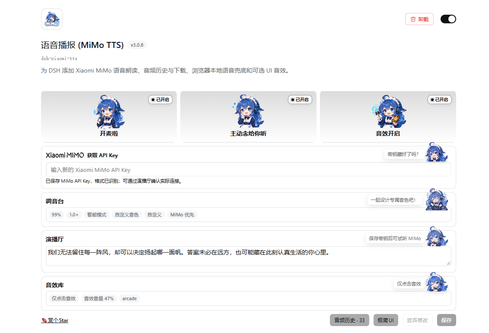
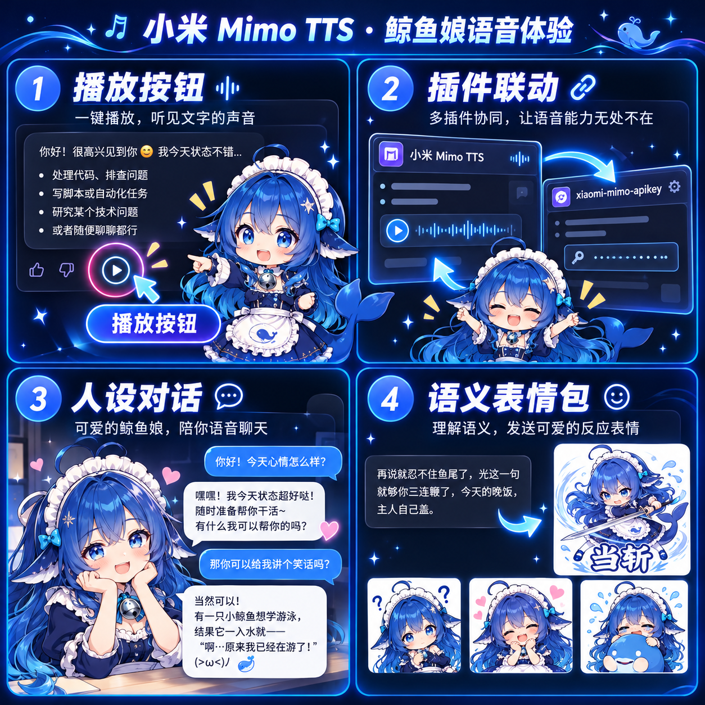
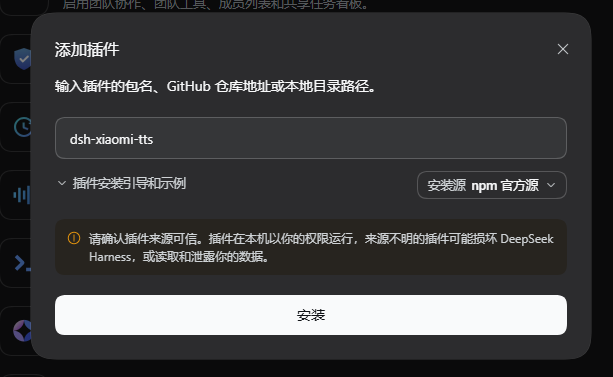
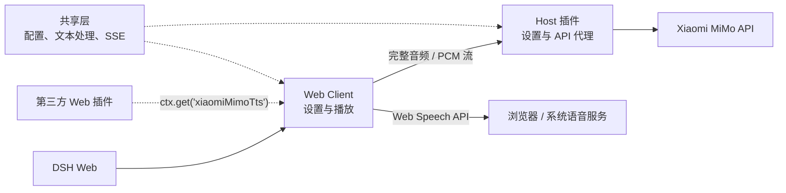

# dsh-xiaomi-tts

[](https://www.npmjs.com/package/dsh-xiaomi-tts)
[](https://www.npmjs.com/package/dsh-xiaomi-tts)


为 DSH 添加 Xiaomi MiMo TTS 语音朗读、浏览器本地语音兜底和可选 UI 音效。

> MiMo TTS 当前可能处于限时免费或调整计费阶段，请以 Xiaomi MiMo 官方平台的最新政策为准。

<p><a href="README.en.md"><strong>English README →</strong></a></p>

## 🎨 预览

- [在线预览设置页面](https://ppy-web.github.io/dsh-plugin-xiaomi-mimo-tts)
- QQ 交流群：`1104616387` 欢迎加入

| 设置界面 | 对话朗读入口 |
|:---:|:---:|
|  |  |

## ✨ 功能

- 一键朗读：在助手消息操作栏中提供“朗读”按钮。
- 低延迟播放：`mimo-v2.5-tts` 支持 PCM 流式播放，并在必要时回退到完整音频或浏览器语音。
- 内置与自定义音色：支持官方内置音色，以及 `mimo-v2.5-tts-voicedesign` 音色描述。
- 浏览器本地语音：可选择 MiMo 优先、本地优先或仅使用 MiMo。
- 朗读范围：支持智能、全文和首段模式。
- 播放控制：支持 0.5×–2.0× 语速、语音音量、暂停、继续和停止。
- 文本清洗：朗读前移除网址、路径、代码块、表情符号和控制字符等不适合播报的内容。
- 可选音效：提供任务状态和语义化点击音效，默认关闭。
- 插件联动：向其他 DSH 插件暴露可选的 PCM 播放服务。
- 鲸鱼娘 Agent 预设：安装后可在 Agent 预设中选择鲸鱼娘女仆助手，提供对话、陪伴、轻量幽默、CDN 表情包反应和本地记忆工具，不依赖外部表情包插件。

## 📋 环境要求

- `@deepseek-ai/dsh` `0.2.0-rc.2`（当前目标版本；兼容 `0.1.7-rc.1` 至 `0.2.x` 版本）
- Node.js 22+
- 使用 MiMo 语音时需要 Xiaomi MiMo API Key
- [官方 TTS API 文档](https://mimo.mi.com/models/zh-CN/mimo-v2.5-tts)

## 🚀 安装

### 官方安装（desktop/web）（推荐）

打开桌面/web端，进入插件管理面板，搜索 `dsh-xiaomi-tts` 即可安装



### 从 npm 安装（web）

```bash
dsh plugin --profile web add dsh-xiaomi-tts@latest
```

### 从插件市场安装

  [插件市场](https://awesome-dsh-plugin.com) 已收录本插件，如你已安装社区的插件市场，可在 **设置 → 插件市场** 中搜索 `xiaomi-mimo-tts`安装。

**侧边栏 → 插件 → dsh-xiaomi-tts → 语音朗读 (MiMo TTS)**

### 卸载（web）

```bash
dsh plugin --profile web remove dsh-xiaomi-tts
```

## 🐋 首次使用

新安装的默认行为：

- 朗读按钮可用；
- **自动播报默认关闭**；
- **UI 音效默认关闭**；
- 未保存 API Key 时，“MiMo 优先”策略可能回退到浏览器本地语音。

推荐配置顺序：

1. [获取 Xiaomi MiMo API Key](https://platform.xiaomimimo.com/console/api-keys)。
2. 在插件设置中输入 Key，并点击底部 **保存**。
3. 打开“调音台”，选择模型和音色。
4. 在“演播厅”试听。
5. 按需开启自动播报和 UI 音效，再次保存。

## ⚙️ 配置说明

### 官方内置音色

`mimo-v2.5-tts` 当前提供：

- 中文女声：`冰糖`、`茉莉`
- 中文男声：`苏打`、`白桦`
- 英文女声：`Mia`、`Chloe`
- 英文男声：`Milo`、`Dean`

### 自定义音色

`mimo-v2.5-tts-voicedesign` 支持从音色描述生成声音。设置面板包含预设模板，也可以手动编辑：

选择“鲸鱼娘”可使用清甜机灵、嘴硬心软的女声：日常轻快，吐槽时平静认真、转折前稍作停顿，关心时温柔放慢，解释任务时专注清晰。音色只控制朗读表现；对话性格由 Agent 预设控制。

### 鲸鱼娘人设

在 Agent 预设中选择“鲸鱼娘”，可使用白饭续航、轻微傲娇、慵懒却可靠的鲸鱼娘女仆助手。她会顺着上下文一本正经地接梗，也会认真陪伴和办事，保留 CDN 表情包与本地记忆能力。人物参考 [DeepSeek Whale-chan Project](https://github.com/Neko3000/deepseek-whalechan)，对话指引见 [人设文件](skills/whale-girl/SKILL.md)。

想同时使用人设和音色，需要分别选择 Agent 预设，以及调音台中的 `mimo-v2.5-tts-voicedesign` → “鲸鱼娘”，保存后在演播厅试听。可试读：“本鲸正在降低待机功耗。你要的清单整理好了，先看这三项。”

升级后，已保存的音色描述仍保留；重新选择“鲸鱼娘”并保存即可应用新版音色描述，自定义描述可继续使用。

### 浏览器本地语音

- **MiMo 优先**：MiMo 在首段音频开始前失败时，尝试浏览器语音。
- **本地优先**：先使用浏览器语音，失败后尝试 MiMo。
- **关闭本地语音**：只使用 MiMo，不进行本地兜底。

浏览器音色来自 Web Speech API。是否离线、可用语言和实际声音取决于浏览器、操作系统及其语音服务。

### 朗读范围

- **智能模式**：自动播报优先朗读首个语义段；未读内容较多时可能补一句收尾提示。手动朗读播放全文。
- **全文模式**：自动播报和手动朗读都播放全文。
- **首段模式**：自动播报和手动朗读都只播放首个语义段。

设置面板支持键盘操作：使用 `Tab` 移动焦点，方向键调整滑块或选项，空格键确认按钮和开关。

## 🔌 三方插件联动


本插件向其他dsh插件提供可选 PCM 流式播放能力：

```ts
ctx.get('xiaomiMimoTts')?.play('欢迎回来')
```

建议通过 `ctx.get()` 动态获取，不要声明为必需注入。插件未安装、未就绪或已关闭时，调用会安全跳过；新播放会中断当前朗读，`stop()` 可主动停止。

需要 TypeScript 类型时：

```ts
import type { XiaomiMimoTtsService } from 'dsh-xiaomi-tts/client-api'

const tts = ctx.get('xiaomiMimoTts') as XiaomiMimoTtsService | undefined
tts?.play('欢迎回来')
```

## 🐳 鲸鱼娘 Agent 预设

安装本插件后，新建会话时可以在 Agent 预设列表选择“鲸鱼娘”。她是对话助手和女仆型陪伴角色：会先接住情绪，再帮你整理任务、解释信息或使用工具；默认带一点傲娇、米饭、尾巴和摸鱼梗，也会在合适时用 CDN 直链发送表情包，但不会每句话强行卖萌。

文件读写、文件搜索和 Windows PowerShell 只用于用户授权的任务与本地非敏感记忆。女仆设定不代表现实控制或绝对服从，危险、违法、隐私和不安全请求仍遵循宿主安全规则。

鲸鱼娘的人设和表情包关键词参考了社区维护的 [DeepSeek-chan Meme Pack](https://github.com/the-beating-light-of-the-nail/deepseek-chan-meme-pack)；图片通过公开 CDN 直链显示，本插件不复制该仓库的图片素材。

鲸鱼娘支持该素材库的 CDN 热链：使用 `` 格式即可直接在对话中显示公开 WebP 预览图。默认使用压缩预览地址，只有用户明确要求原图时才使用原图地址。

## 🔒 隐私与网络访问

- API Key 由 DSH Host 保存，浏览器只读取“是否已配置/格式是否识别”的状态，不读取密钥正文。
- 浏览器本地语音由 Web Speech API 提供；标记为在线的音色可能把文本交给浏览器、操作系统或其网络语音服务。
- MiMo 生成的音频自动保存在当前浏览器的 IndexedDB 中。设置底部按钮区的「音频历史」按钮进入独立历史页；最多保留最近 100 条 / 100 MB，超出后清理最旧记录。记录包含音频和最多 500 字的文本摘要。
- 流式 PCM 保存为 24 kHz 单声道 WAV；流式批次和分段生成分别列出，仅保留成功完成的生成请求，取消或失败的流不会保存为完整音频。Web Speech API 本地语音没有可导出的音频文件。重听或下载不会再次请求 MiMo；历史仅属于当前浏览器与站点地址，不跨设备同步，清除站点数据会删除记录。浏览器存储不可用或已满时，列表会提示仅本次打开有效。
- 音效核心移植自 [uisfx 0.4.0](https://github.com/romainsimon/uisfx)，遵循 MIT License，详见 `NOTICE`。

## 🏗️ 架构

- **共享层**：配置默认值、文本处理、分段、SSE 和播放契约。
- **Host 插件**：注册设置与静态资源，并代理 MiMo 完整音频和 PCM 流式请求。
- **Web Client**：提供设置、消息朗读、浏览器语音兜底、试听和第三方播放服务。


```mermaid
flowchart LR
    DSH["DSH Web"] --> CLIENT["Web Client<br/>设置与播放"]
    THIRD["第三方 Web 插件"] -. "ctx.get('xiaomiMimoTts')" .-> CLIENT
    CLIENT -->|"完整音频 / PCM 流"| HOST["Host 插件<br/>设置与 API 代理"]
    HOST --> MIMO["Xiaomi MiMo API"]
    CLIENT -->|"Web Speech API"| SPEECH["浏览器 / 系统语音服务"]
    SHARED["共享层<br/>配置、文本处理、SSE"] -.-> CLIENT
    SHARED -.-> HOST
```

## 🛠️ 开发

```bash
pnpm install
pnpm dev
```

`pnpm dev` 会启动本地 UI Lab，直接渲染 `src/client/settings/card.tsx`。设置保存、远程语音和版本检查使用本地 mock，不会调用真实 MiMo 服务。

常用检查：

```bash
pnpm typecheck
pnpm test
pnpm dev:build
pnpm pack:check
```

- `pnpm build`：正常构建。
- `pnpm build:debug`：启用 PCM 链路调试日志的构建。
- `pnpm profile:check`：验证本机 DSH Web profile 中的安装状态。

Windows 从本地开发链接切换到 npm 包前，请先停止 DSH Web，避免运行中的 Node 进程占用 Junction：

```powershell
.\start\dsh-plugin-reinstall.bat 3.0.8
```

如果是 DSH Desktop profile，只需要卸载残留的本地链接，可在退出 Desktop 后运行：

```powershell
.\start\dsh-plugin-uninstall-local-link.bat desktop
```

## 🤝 推荐

> 鲸鱼娘形象参考社区由GPT生成
> uisfx音效参考 `dsh-plugin-uisfx`实现

- [dsh-deep-whale](https://github.com/Small-tailqwq/dsh-deep-whale#readme) · 鲸鱼娘主题皮肤系列。
- [dsh-whale-musume](https://github.com/Sutera-Diffusus/dsh-whale-musume#readme) · 元气鲸鱼娘桌宠。
- [dsh-plugin-uisfx](https://github.com/XanthanL/dsh-plugin-uisfx#readme) · 语义化 UI 音效。
- [dsh-dream-skin](https://github.com/RevolutionLA/dsh-dream-skin#readme) · 原生换肤、背景壁纸、强调色和主题包。
- [dsh-TUI](https://github.com/ccch1mneyyy/dsh-TUI) · 一个为 dsh-TUI 生态打造的插件
